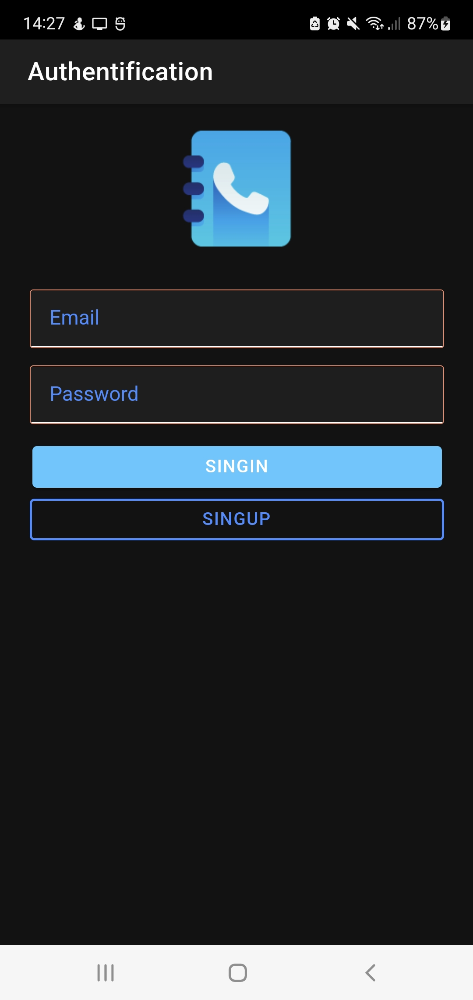
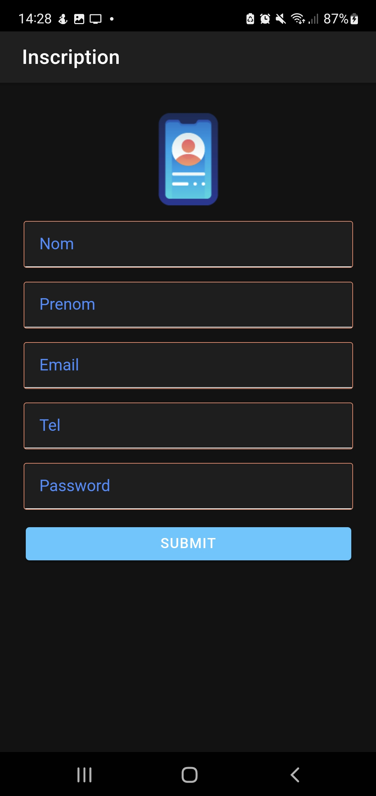
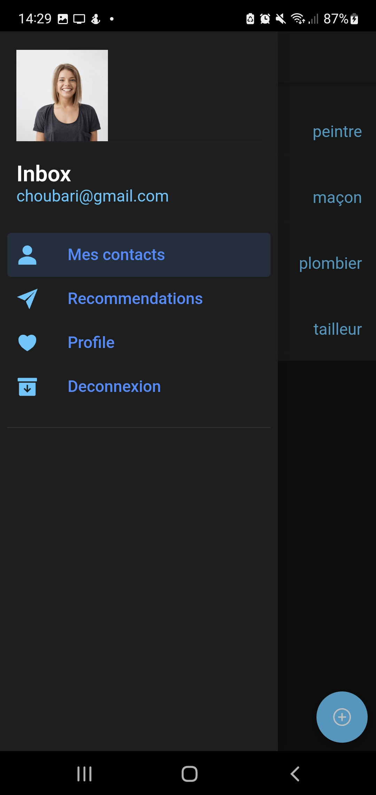
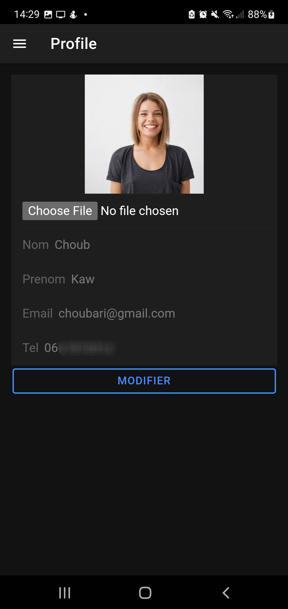
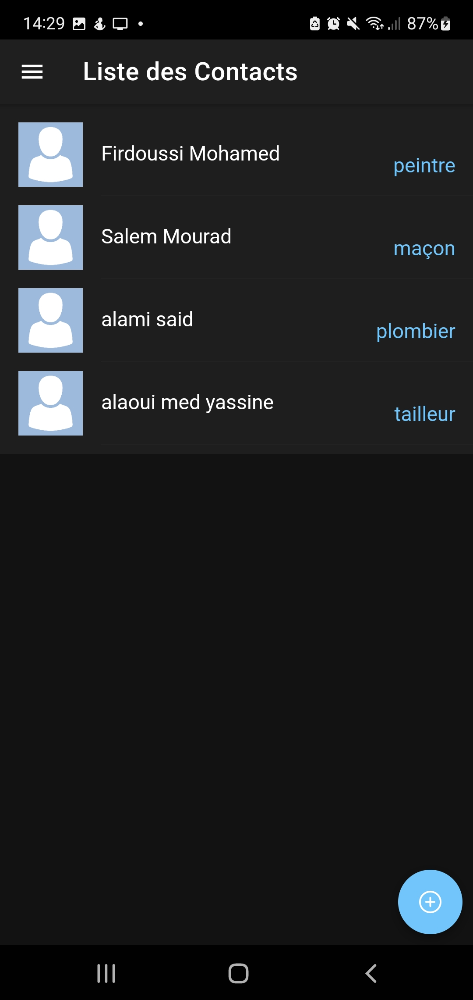
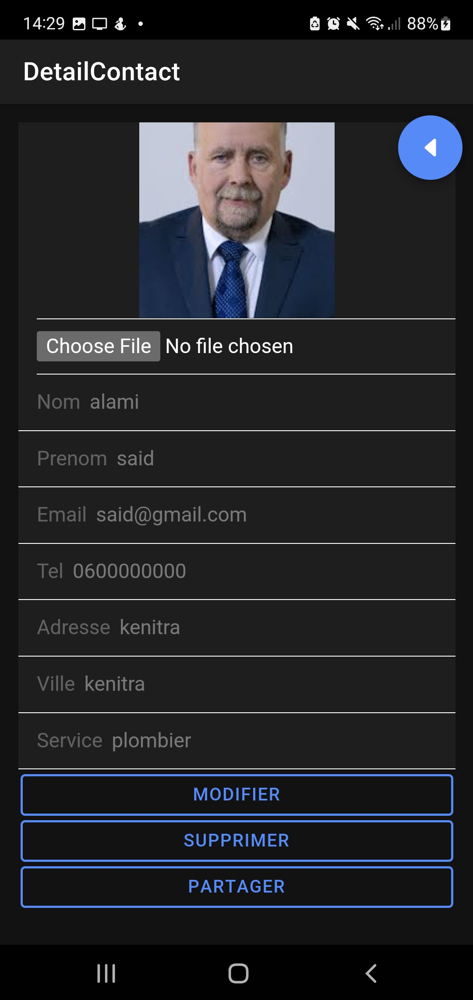
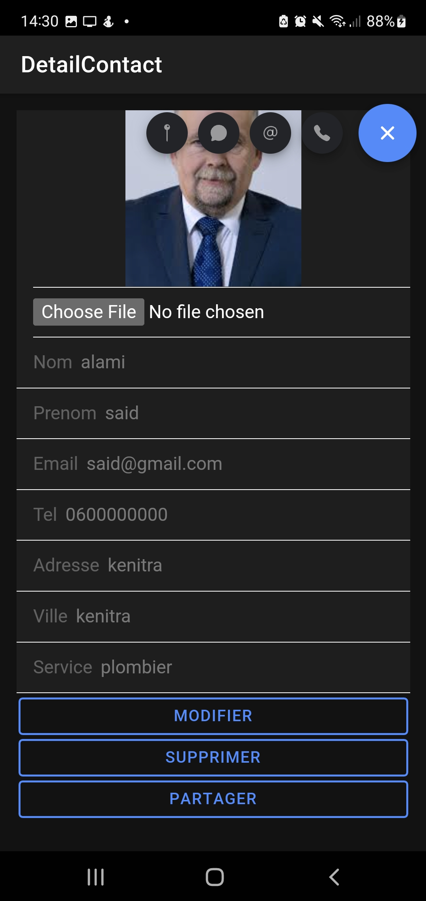

# Contacts-Manager

Ionic App (Cordova, Angular, TypeScript) with Firebase to manage contacts.

## Features

* Login & Signup
* Adding, editing and deleting contacts
* CTA buttons in Contact Profile (SMS, Phone Call, Whatsapp message, Maps Position)
* Sharing your contacts with all platform users
* Personal Profile Customization
* Light & Dark mode depending on the device

## Screenshots

  
  
  
  
  
  
  

